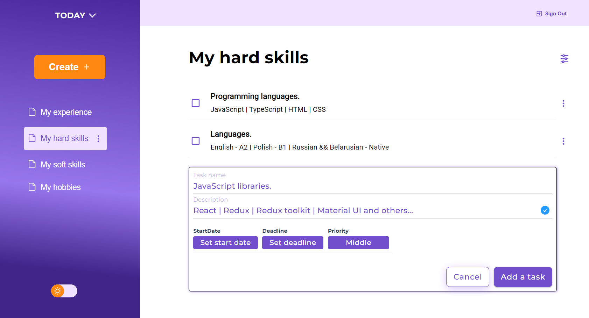
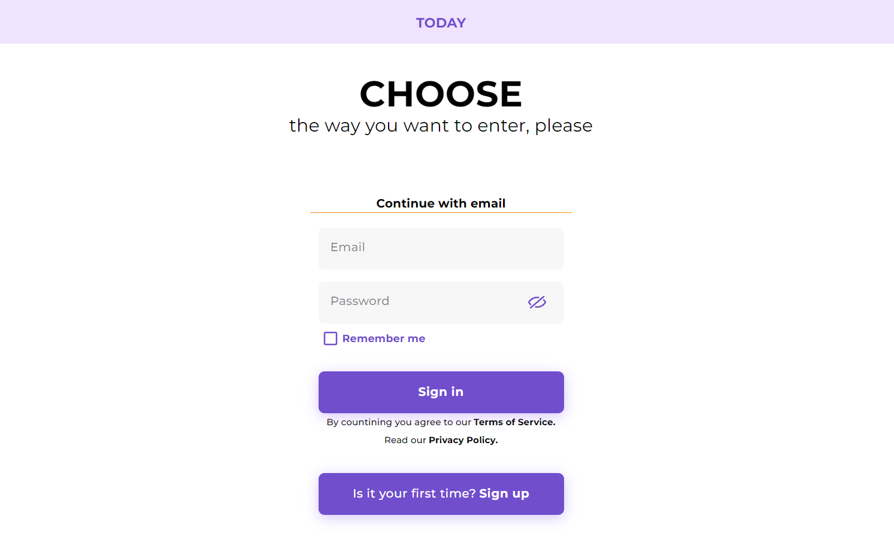
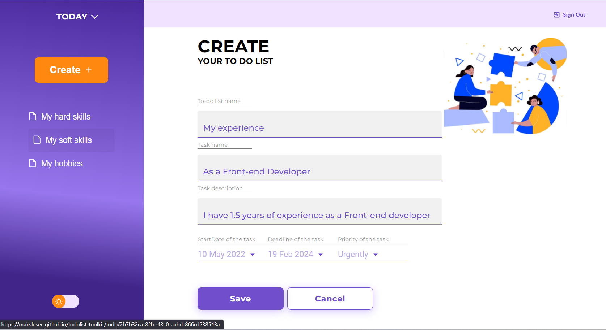

# Today

---

## Description

This project allows users to create, delete to-do lists and modify to-do lists.  
Users can create tasks within a to-do list, set deadlines, start dates, and priorities, as well as delete tasks  
or change task names and filter tasks.  
This project is designed to be useful, as it allows users to efficiently plan both work tasks and personal life.  

I was collaborating on this project with a designer who is responsible for the design aspect.  
About the team: <a href="https://www.linkedin.com/in/maxim-lesev-frontend/">Maxim Lesev</a>
, <a href="https://www.linkedin.com/in/olga-zamaro-a24b031b1/">Olga Zamaro</a>.  
To create tasks we've used Jira and had daily scrum meetings to communicate and catch up with the team. 

Application functionality:  

- Loginization  
- Create / edit / removal a to-do list  
- Adding / edit / removal a task  
- Setting start dates for each task  
- Setting deadlines for each task  
- Setting priorities for each task  
- Filtering tasks  
- Switching theme  

---

### :briefcase: language and tools

 

- **react**

- **typescript**

- **redux-toolkit**

- **react-router-dom**

- **material-ui**

- **axios**

- **formik**

- **dayjs**

- **cross-browser compatibility**

- **CSS**

- **HTML**
   
   

[//]: # '___'

## Loginization / Registration

To register, click on the button that says -  'Is it your first time? Sing up'.  
You will be redirected to the server's website, where you'll need to enter your email address and password  
to complete the registration process, as I'm using another site's public server.

Afterwards, check your email and confirm your registration. Once confirmed, return to the application and log in using
the email and password you provided during registration. 

## Create to-do list

When creating a to-do list, you simply need to enter names for the to-do list and click on the save button.  
You can add tasks, set priorities, deadlines, and other details either during the creation of the to-do list or after
its creation.

## Important!

I have deployed the application to GitHub. When updating the application, a 404 error may occur due to an issue with
GitHub itself, and the server does not allow me to deploy the application elsewhere (CORS errors may appear).
To update the page, you need to enter the following URL: "https://maksleseu.github.io/todolist-toolkit/"

## How to start a project

After git clone 'link' install all dependencies from package.json:

### `yarn`

and then run the project:

### `yarn start`
